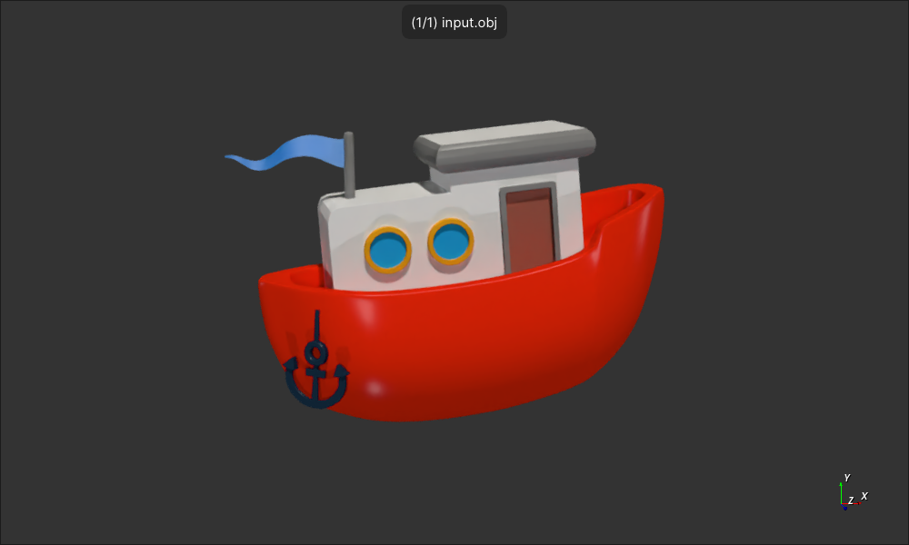
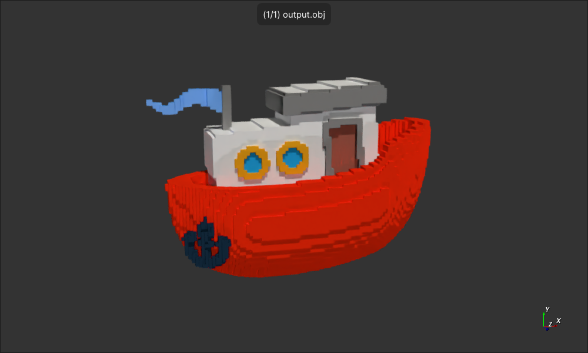

Based on https://github.com/mariogeiger/obj2voxel

Tool for .obj to voxel/bricks(merged voxels) colorized conversion:
input.obj -(fn load_obj)-> vertices, faces, colors_idxs, colors_names -(fn obj2voxel)-> voxels(flat u16 arr), voxel_size, colors_names -(fn merge_voxels)-> bricks(with 1 × 1 × 1 size if merging is not specified) -(fn save_as_obj)-> output.obj

**Tool features:**

- voxel merging along one of horizontal axis available
- color aware conversion available

**Usage:**

    rust_obj-to-voxels-colorized [input_file_path] [size(for size x size x size voxel_grid)] [output_file_path] --max-merge-length(opt) [max_merge_length(opt)] --mtl-file-path(opt) [mtl_file_path(opt)]

    - input_file_path, output_file_path - input and output obj file paths
    - size - the size in voxels of the resulting grid dimensions (voxel grid will be size × size × size)
    - mtl_file_path - mtl file path for color aware conversion
    - max_merge_length - max amount (1 by default) of voxels to horizontal one-dimensional brick merging (bricks will be either 1 × 1 × <=max_merge_length or 1 × <=max_merge_length × 1)

**Examples:**

*input model:

- `rust_obj-to-voxels-colorized input.obj 100 output.obj --max-merge-length 4 --mtl-file-path model.mtl`:
Merged 17623 bricks from 28813 voxels, *saved ./output.obj file:

**Details:**

- merging with the applied mtl file may work worse cause of the color difference
